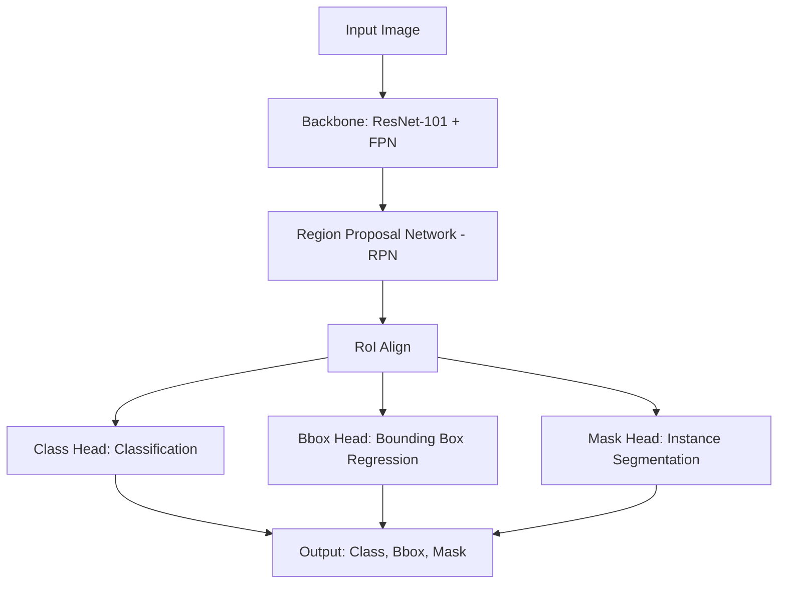
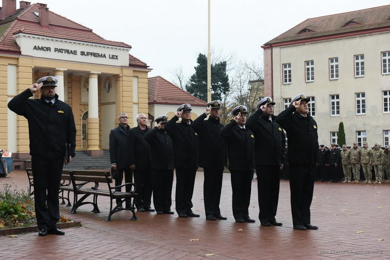
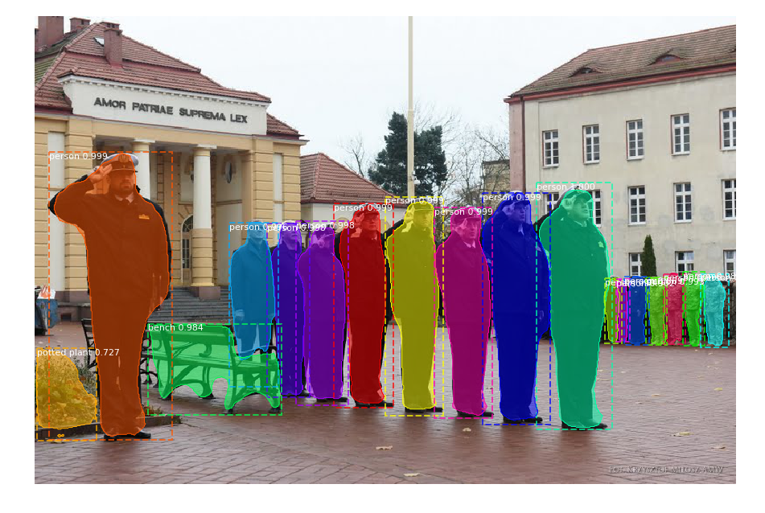
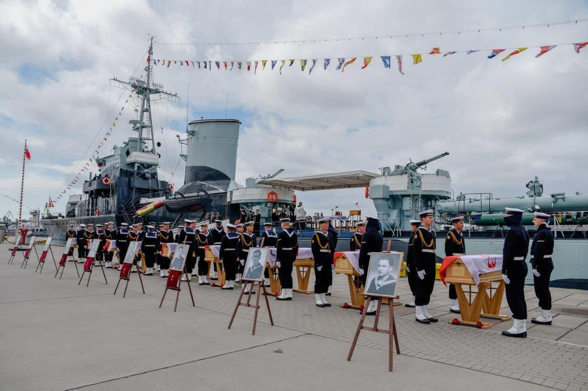
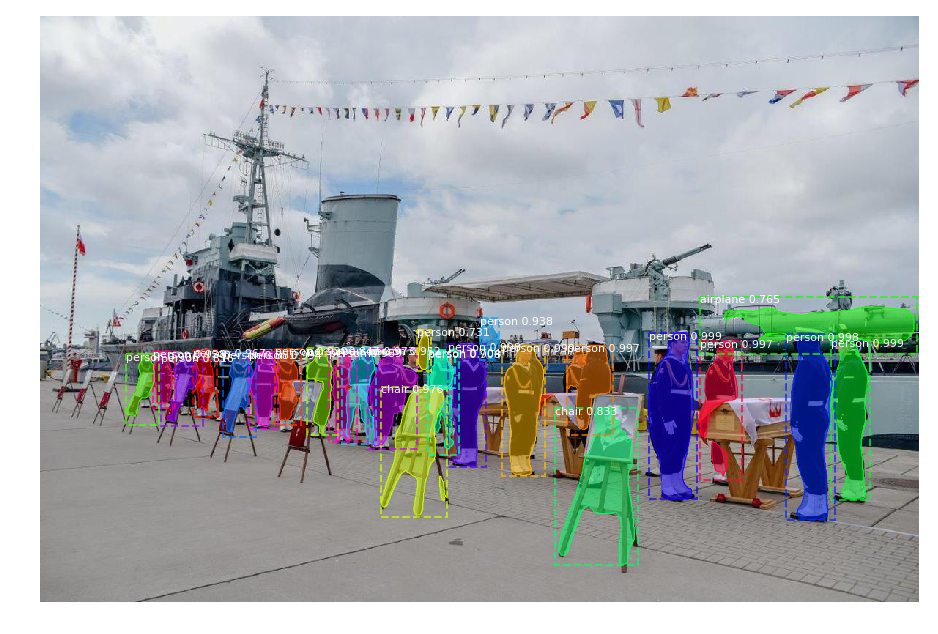

# OPOS Mask R-CNN Implementation

This repository contains a Python implementation of the Mask R-CNN algorithm for object detection and instance segmentation. It is based on the popular Matterport Mask R-CNN library and uses a pre-trained ResNet-101 backbone on the MS COCO dataset.

## Table of Contents
- [Overview](#overview)
- [Features](#features)
- [Architecture](#architecture)
- [Installation](#installation)
- [Quick Start](#quick-start)
- [Training on Custom Dataset](#training-on-custom-dataset)
- [Results](#results)
- [Project Structure](#project-structure)
- [Dependencies](#dependencies)
- [Acknowledgments](#acknowledgments)

## Overview
Mask R-CNN is a deep learning model developed by Facebook AI Research (FAIR) that extends Faster R-CNN by adding a branch for predicting segmentation masks on each Region of Interest (RoI). This allows the model to not only detect objects in an image but also to generate a high-quality segmentation mask for each instance.

This specific project was adapted for various detection tasks, including potential maritime and military scenarios, as demonstrated in the example images.

## Features
- **Instance Segmentation**: Detects and segments individual objects within the same class.
- **Pre-trained Weights**: Includes support for MS COCO pre-trained weights for transfer learning.
- **Flexible Backbone**: Built on ResNet-101 and Feature Pyramid Network (FPN).
- **Inference Script**: Simple `mask_rcnn_starter.py` for quick testing.
- **COCO Support**: Integrated with the MS COCO dataset for training and evaluation.

## Architecture
The Mask R-CNN architecture consists of two main stages:
1. **Region Proposal Network (RPN)**: Proposes candidate object bounding boxes.
2. **Detection and Mask Branch**: Predicts the class, refines the bounding box, and generates a binary mask for each proposal.



## Installation
### Prerequisites
- Python 3.4 or higher (Python 3.6+ recommended)
- CUDA 9.0 and cuDNN 7.0.5 (for GPU acceleration)

### Steps
1. **Clone the repository**:
   ```bash
   git clone https://github.com/your-username/OPOS_Mask_R-CNN.git
   cd OPOS_Mask_R-CNN
   ```

2. **Install dependencies**:
   It is recommended to use a virtual environment.
   ```bash
   pip install -r requirements.txt
   ```

3. **Install MS COCO Tools** (Optional, for COCO evaluation):
   ```bash
   pip install cython
   pip install git+https://github.com/philferriere/cocoapi.git#subdirectory=PythonAPI
   ```

## Quick Start
To run the detection on a random image from the `images/` directory using the pre-trained COCO weights:

```bash
python3 mask_rcnn_starter.py
```

The script will automatically download the `mask_rcnn_coco.h5` weights if they are not present in the project root.

### Example Code Snippet
```python
import mrcnn.model as modellib
from mrcnn import visualize
import coco

# Load configuration
class InferenceConfig(coco.CocoConfig):
    GPU_COUNT = 1
    IMAGES_PER_GPU = 1

config = InferenceConfig()

# Create model and load weights
model = modellib.MaskRCNN(mode="inference", model_dir="logs", config=config)
model.load_weights("mask_rcnn_coco.h5", by_name=True)

# Run detection
results = model.detect([image], verbose=1)
r = results[0]

# Visualize results
visualize.display_instances(image, r['rois'], r['masks'], r['class_ids'], class_names, r['scores'])
```

## Training on Custom Dataset
Training requires preparing your own dataset in a format compatible with the `Dataset` class.

1.  **Prepare Annotations**: Use tools like [VGG Image Annotator (VIA)](http://www.robots.ox.ac.uk/~vgg/software/via/) to create JSON annotations.
2.  **Define Dataset Class**: Subclass `utils.Dataset` and implement `load_mask` and `image_reference`.
3.  **Configure Training**: Create a configuration class inheriting from `Config`.
4.  **Run Training**:
    ```python
    model = modellib.MaskRCNN(mode="training", config=config, model_dir=MODEL_DIR)
    model.train(dataset_train, dataset_val, learning_rate=config.LEARNING_RATE, epochs=30, layers='heads')
    ```

## Results
Below are examples of the model's performance on maritime/military scenes.

| Original Image | Mask R-CNN Result |
| :---: | :---: |
|  |  |
|  |  |

## Project Structure
- `coco/`: COCO-specific configuration and data loading.
- `images/`: Directory containing sample images for testing.
- `results/`: Visualization results.
- `mask_rcnn_starter.py`: Entry point for running inference.
- `requirements.txt`: List of required Python packages.

## Dependencies
| Package | Version |
| :--- | :--- |
| TensorFlow | >= 1.3.0 |
| Keras | >= 2.0.8 |
| NumPy | Latest |
| Scikit-image | Latest |
| OpenCV-Python | Latest |
| Matplotlib | Latest |

## Acknowledgments
This implementation is based on the [Mask R-CNN by Matterport, Inc.](https://github.com/matterport/Mask_RCNN), which is released under the MIT License.
